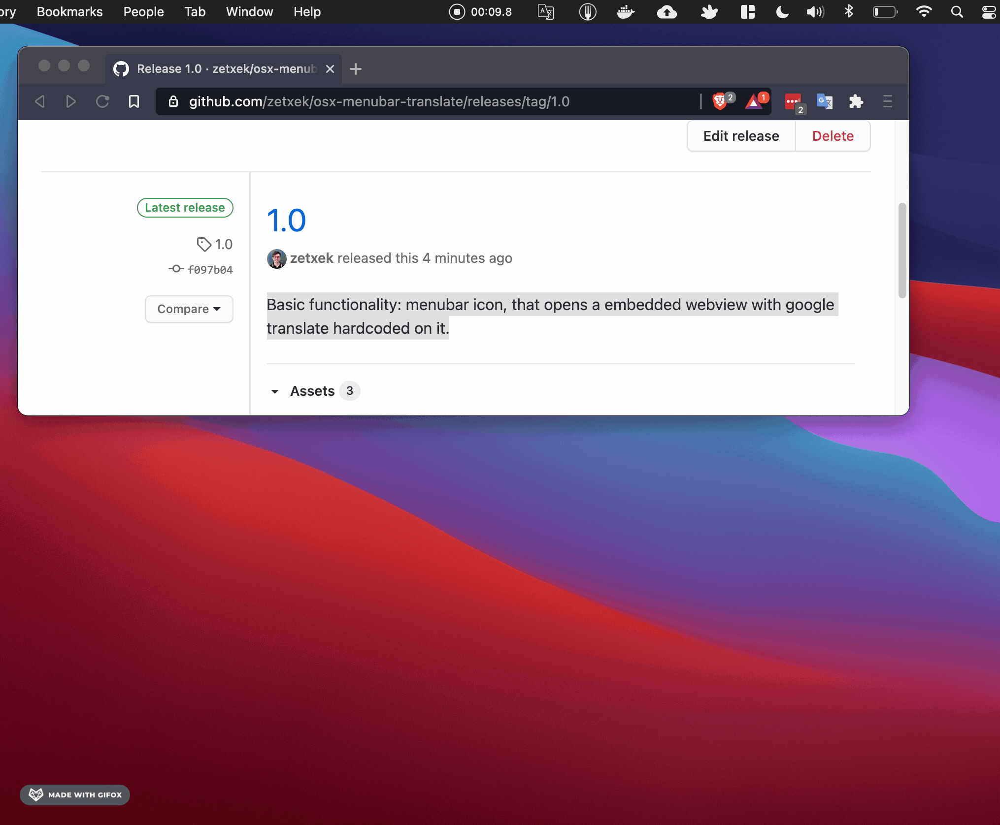

# README #

MenuBar Translate is a very simple app that lets you have a quick shortcut to Google Translate in your OS X menu bar and integrate it with the OS X "Services" menu. It's main purpose is to allow you to have Google Translate by hand at all times, without needing to open a new browser window.

One click, and you're ready to translate.

## Download

Get the last binary in [the releases section](https://github.com/zetxek/osx-menubar-translate/releases).

## Contributing

The project just solves a personal need I have: I am Spanish and live abroad (first in The Netherlands, now in Denmark), so often I need to translate texts or words I don't know yet.

If this project is useful for you and you would like to get it improved, feel free to [create an issue](https://github.com/zetxek/osx-menubar-translate/issues), or [open a PR](https://github.com/zetxek/osx-menubar-translate/pulls) straight away. It will be more than welcome!

## Screenshots
The icon in the menu bar:

The embeded window open:

The Finder service integration 

## License

MIT License, available in [license.md](license.md).
