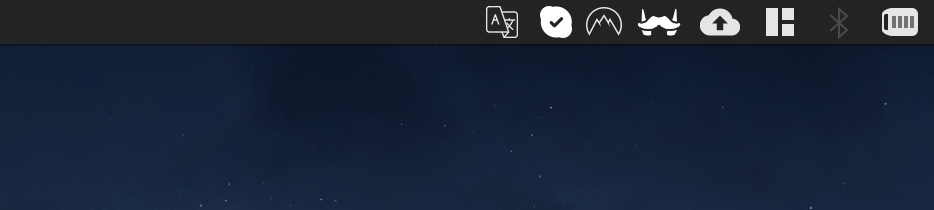
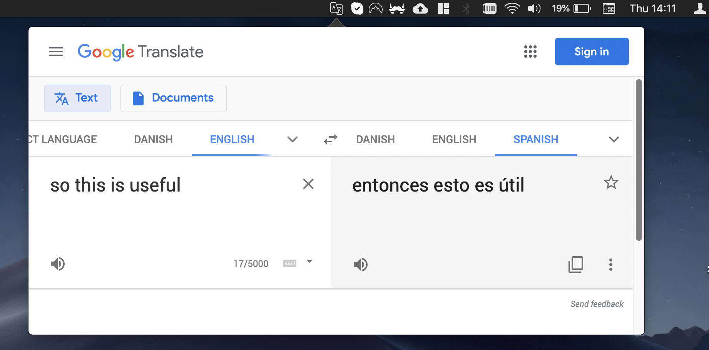

# README #

MenuBar Translate is a very simple app that lets you have a quick shortcut to Google Translate in your OS X menu bar.

One click, and you're ready to translate.

## Contributing

The project just solves a personal need I have: I am Spanish and live in The Netherlands, so often I need to translate texts or words I don't know yet (mostly in Dutch, but also in English as that's my main work language).

If this project is useful for you and you would like to get it improved, feel free to [create an issue](https://github.com/zetxek/osx-menubar-translate/issues), or [open a PR](https://github.com/zetxek/osx-menubar-translate/pulls) straight away. It will be more than welcome!

## Screenshots
The icon in the menu bar:

The embeded window open:

## License

MIT License, available in [license.md](license.md).
