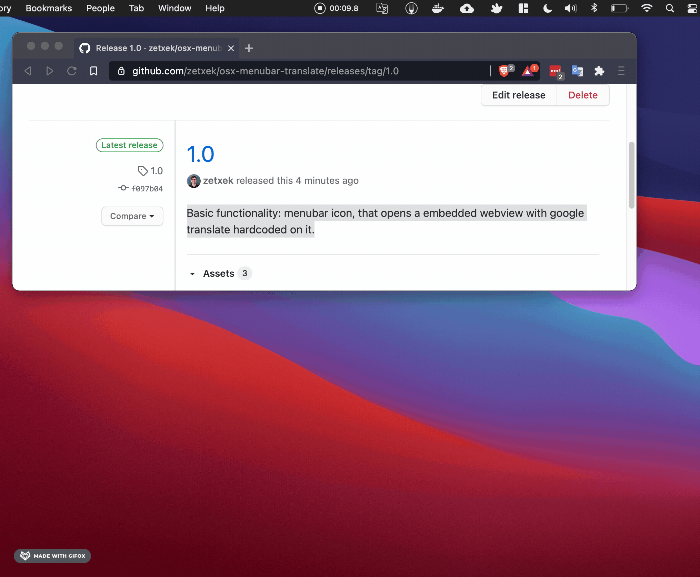
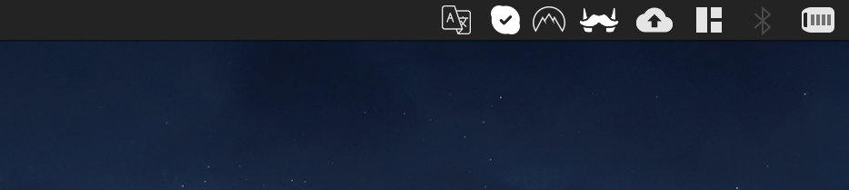
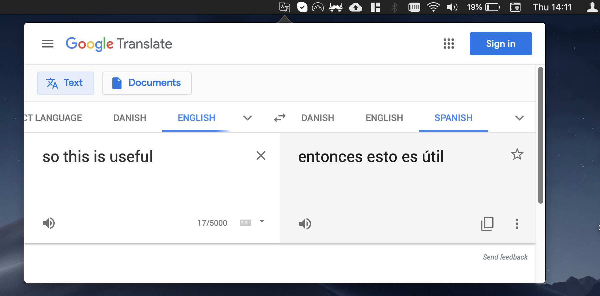

# MenuBar Translate

MenuBar Translate keeps Google Translate in your macOS menu bar: click the icon and translate instantly, without opening a browser window. It supports dark mode and integrates with the macOS "Services" menu, so you can select text in any app and send it straight here.

One click, and you're ready to translate.



You can open the application from your menubar, as well as from the macOS contextual service ("Services > Translate in MenuTranslate"):


## Download

Get the latest binary from [the releases section](https://github.com/zetxek/osx-menubar-translate/releases).
Unzip the file and drag & drop it into the Applications folder.

**The first time you open it, right-click the app and choose Open** (rather than double-clicking), then confirm. macOS will otherwise refuse to launch it, saying it can't verify the developer.

That's because the app isn't notarized — notarization requires a paid Apple Developer Program membership, and this is a free app I maintain in my spare time. The build is ad-hoc signed instead, exactly as previous releases have been. You only need the right-click once; afterwards it opens normally.

Requirements: macOS 12.4+, Intel or Apple Silicon.

## Features

- **One click to translate**: the WebView stays resident in memory, so the window opens with no load wait
- **Dark mode**: follows the system appearance and switches live. Google Translate's web version has no dark theme of its own, so this app implements a soft dark grey via a CSS filter — no reload needed when you switch
- **Services menu integration**: select text in any app → right-click → Services → Translate in MenuTranslate
- **Right-click menu**: version info (read from Info.plist), Start at Login, About, Quit
- **Start at Login**: toggle it from the right-click menu (macOS 13+). On macOS 12 the item is hidden — add the app to Login Items in System Settings by hand instead
- **No tracking at all**: well, except the tracking Google does on the Translate instance loaded in the embedded WebView — but nothing by me
- **Sandboxed**: App Sandbox enabled, requesting outbound network access — plus a read-only user-selected-files entitlement that the project's build settings add and nothing in the app currently uses

Code-wise it might also serve you as a blueprint for embedding a WebView with a service that receives text from other contexts.

## Supported key shortcuts

Available inside the translate window (and while Caps Lock is on):

| Shortcut | Action |
|---|---|
| `cmd + a` | **select all** |
| `cmd + c` | **copy** |
| `cmd + v` | **paste** |

A menu bar app has no Edit menu for these to route through, so the app intercepts the key events and bridges them into the page via JavaScript.

## Architecture

~575 lines of Swift across four files:

```
User entry points (three, converging on one path)
┌─ Menu bar icon, left click ─┐
├─ Right-click menu           ─┼─▶ AppDelegate ──▶ TranslateViewController
└─ System "Services" menu     ─┘        │                   │
                                  EventMonitor        WKWebView (Google Translate)
                              (closes on outside click)  TranslateWebView
                                                       (cmd+C/V/A ↔ JS bridge)
```

| File | Responsibility |
|---|---|
| `AppDelegate.swift` | Entry dispatch, popover lifecycle, Services registration, version menu |
| `TranslateViewController.swift` | WebView host, translate URL encoding, dark mode injection, focus management |
| `TranslateWebView.swift` | Keyboard interception, JS bridge between the pasteboard and the page |
| `EventMonitor.swift` | Global click monitor (detects clicks outside the popover) |

## Building it yourself

```bash
git clone https://github.com/zetxek/osx-menubar-translate.git
cd osx-menubar-translate
open "Translate Menu.xcodeproj"   # Run straight from Xcode
```

Or from the command line (ad-hoc signing):

```bash
xcodebuild -project "Translate Menu.xcodeproj" -scheme "Translate Menu" \
  -configuration Debug build \
  CODE_SIGN_IDENTITY="-" CODE_SIGN_STYLE=Manual \
  DEVELOPMENT_TEAM="" PROVISIONING_PROFILE_SPECIFIER=""
```

### Cutting a release (maintainers)

`scripts/release.sh <version>` builds, packages and verifies a release, refusing to continue if anything is wrong. Bump `MARKETING_VERSION` in both build configurations first.

```bash
scripts/release.sh X.Y.Z --adhoc
gh release create vX.Y.Z ./TranslateMenu-X.Y.Z.zip --title "vX.Y.Z" --notes-file notes.md
```

Replace `X.Y.Z` with the version you just bumped to. `scripts/release.sh` refuses to run
if it doesn't match `MARKETING_VERSION`, and prints the project's current version if you
run it with no arguments.

`--adhoc` is currently required, because notarization needs an active Apple Developer Program membership and this project's has expired. An expired membership silently drops you to a free "Personal Team", which cannot create a Developer ID certificate or notarize at all — Xcode will only offer you Apple Development certificates.

If the membership is ever renewed, drop `--adhoc` and the script will sign with Developer ID, notarize, staple and verify Gatekeeper accepts the result. That also needs a notarytool keychain profile named `notary`:

```bash
xcrun notarytool store-credentials notary \
  --apple-id <your-apple-id> --team-id <your-team-id> \
  --password <app-specific-password>
```

The app-specific password comes from appleid.apple.com → Sign-In and Security → App-Specific Passwords. It is not your Apple ID password.

The script's flags matter. `-destination 'generic/platform=macOS'` is what produces a universal binary — without it `xcodebuild` builds only the host architecture, which is how v1.2.1 shipped arm64-only. `CODE_SIGN_INJECT_BASE_ENTITLEMENTS=NO` strips the `get-task-allow` debug entitlement, which notarization rejects. The script verifies both before submitting.

## Fixes in this release

- Fixed pasting text containing quotes, backslashes or newlines (hand-rolled JS escaping replaced with JSON encoding)
- Fixed text being dropped on the first Services-menu translation after a cold start
- Fixed the menu bar icon sometimes needing two clicks (click detection now uses the triggering event instead of live mouse state)
- Fixed the window closing when clicking IME candidates while typing Chinese (outside-click detection now uses mouse coordinates)
- Fixed cmd+C/V/A breaking while Caps Lock is on
- Fixed the loading spinner spinning forever on reopen or when the network drops
- Fixed translations getting stuck on "…" after closing the popover mid-translation (the suspended WebContent process drops the in-flight request and Google's page never retries — reopening now re-triggers it)
- Fixed the menu version number being hardcoded in the xib and drifting from the real version
- Added dark mode, and a white-flash guard while loading

## Contributing

The project just solves a personal need I have: I am Spanish and live abroad (first in The Netherlands, now in Denmark), so often I need to translate texts or words I don't know yet.

If this project is useful for you and you would like to get it improved, feel free to [create an issue](https://github.com/zetxek/osx-menubar-translate/issues), or [open a PR](https://github.com/zetxek/osx-menubar-translate/pulls) straight away. It will be more than welcome!

## Screenshots

The icon in the menu bar:



The embedded window open:



## License

MIT License, available in [license.md](license.md).
